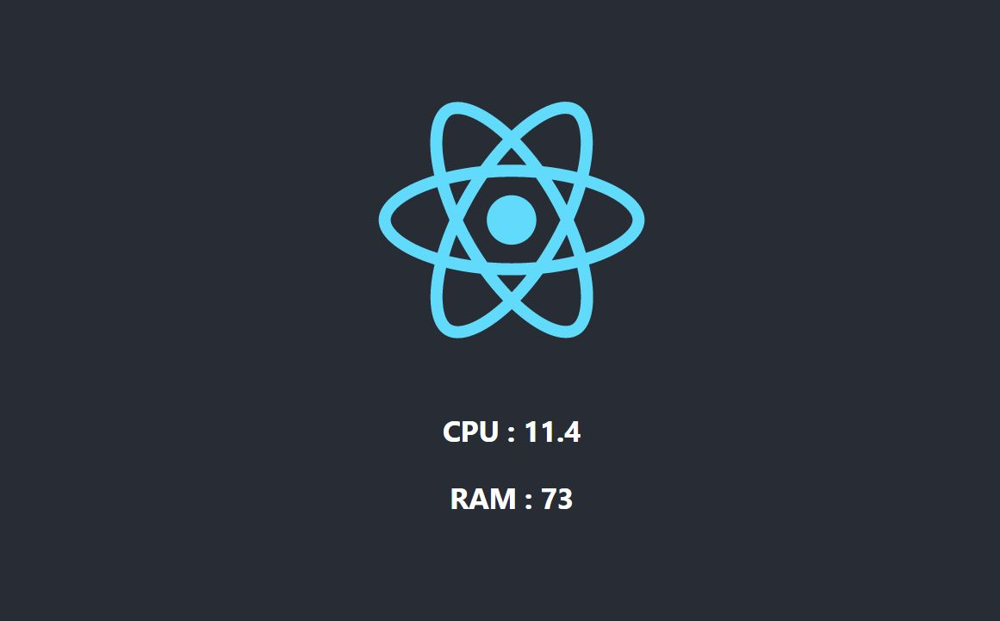

# DevOps-Assignment

This DevOps Assignment represents exactly the type of tasks which you might have to do as a DevOps Engineer at SmartCow. In this repo, you will find a simple Python - Flask Web App, which reads the current RAM and CPU usage and a React frontend which shows the statistics in the browser.

## How to run?

The app is setup in a pretty standard way, just like most Python-React Apps.

### Python Backend
In the api directory, do the following. 
1. `pip install -r requirements.txt`
2. `python app.py`
3. Visit `http://localhost:8000/stats`

### React Frontend
In the sys-stats directory, do the following.
1. `npm install`
2. `npm start`

## Task 1 - Dockerize the Application

The first task is to dockerise this application - as part of this task you will have to get the application to work with Docker and Docker Compose. 
You are expected to get this app to work with UWSGI or Gunicorn and serve the react frontend through Nginx. 

The React container should also perform `npm build` every time it is built.

Hint/Optional - Create 3 separate containers. 1 for the backend, 2nd for the proxy and 3rd for the react frontend.

It is expected that you create another small document/walkthrough or readme which helps us understand your thinking process behind all of the decisions you made. 

The only strict requirement is that the application should spin up with `docker-compose up --build` command. 

You will be evaluated based on the
* best practices
* ease of use
* quality of the documentation provided with the code

## Task 2 - Deploy on Cloud

Next step is to deploy this application to absolutely any cloud of your choice. Use IaC (Infrastructure as code) where applicable.

> It's important to remember here that the application is already containerize, maybe you could deploy it to services which take an advantage of that fact. (example, AWS EKS?)

You could use any other cloud service provider of your choice too (but AWS recommended). Use the smallest instance size available to save up on the cloud costs. 

The React App should be accessible on a public URL, that's the only hard requirement. 

Use the best practices for exposing the cloud VM to the internet, block access to unused ports, add a static IP (elastic IP for AWS), create proper IAM users and configure the app exactly how you would in production. Write a small document to explain your approach.

You will be evaluated based on the

* best practices
* quality of the documentation provided with the code

### Task 3 - Get it to work with Kubernetes

Next step is completely separate from step 2. Go back to the application you built in Stage 1 and get it to work with Kubernetes.

Separate out the two containers into separate pods, communicate between the two containers, add a load balancer (or equivalent), expose the final App over port 80 to the final user (and any other tertiary tasks you might need to do)

Add all the deployments, services and volume (if any) yaml files in the repo.

The only hard-requirement is to get the app to work with `minikube`

## Summary

This documentation is supposed to be very high-level, you will be evaluated on the basis of the low level decisions you make while implementing it and your thought process behind them. If you have any questions at all feel free to reach out and ask for help.

Best of luck!

PS Please package your code up in a Github repo and share the link

